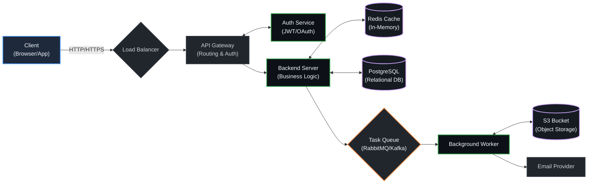
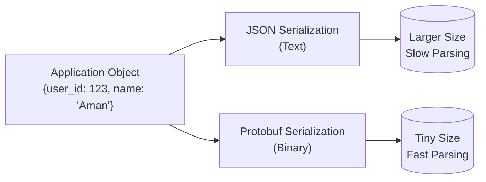
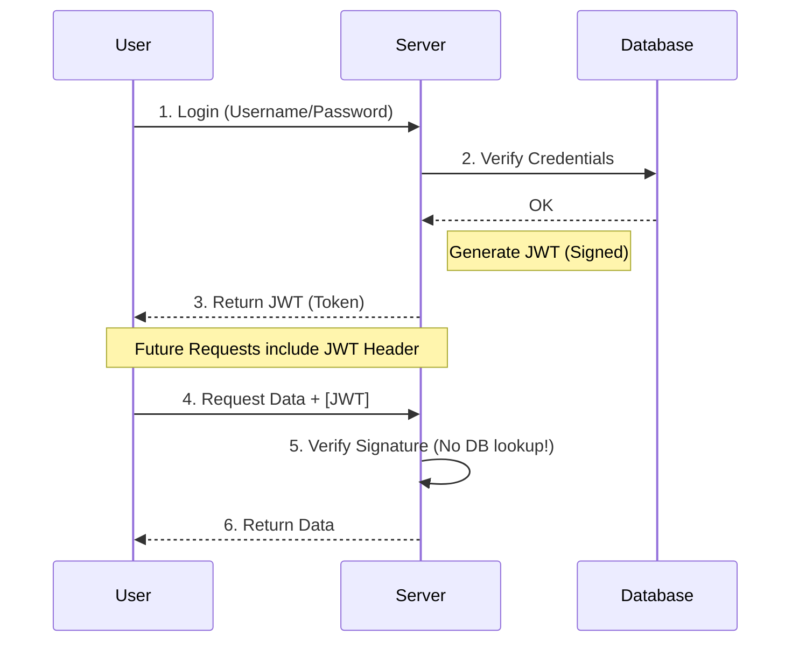

# Backend_sriniously

# **Complete Backend Engineering Learning Path**

This is an absolutely comprehensive roadmap for backend engineering. Based on your detailed outline, I've organized this into a structured learning path with clear milestones.


## **📚 Complete Backend Engineering Curriculum**

```text
┌─────────────────────────────────────────────────────────────────────────────────────────┐
│  BACKEND ENGINEERING ROADMAP                                                            │
│  From Fundamentals to Production-Ready Systems                                          │
└─────────────────────────────────────────────────────────────────────────────────────────┘
```                                                                                


## **📑 Table of Contents**

```text
┌─────────────────────────────────────────────────────────────────────────────────────────┐
│  DOCUMENT NAVIGATION                                                                    │
└─────────────────────────────────────────────────────────────────────────────────────────┘
```


<div class="mermaid-container">
<h3 style="text-align: center; margin-bottom: 1rem; color: var(--accent);">Modern Backend Architecture: The Big Picture</h3>

</div>


<h3 style="text-align: center; margin-bottom: 1rem; color: var(--accent);">Modern Backend Architecture: The Big Picture</h3>
    Client["Client<br>(Browser/App)"]:::client -->|HTTP/HTTPS| LB{"Load Balancer"}:::infra
    
    LB --> API["API Gateway<br>(Routing & Auth)"]:::infra
    
    API <--> Auth["Auth Service<br>(JWT/OAuth)"]:::service
    API --> App["Backend Server<br>(Business Logic)"]:::service
    
    App <--> Cache[("Redis Cache<br>(In-Memory)")]:::data
    App <--> DB[("PostgreSQL<br>(Relational DB)")]:::data
    App --> Queue{"Task Queue<br>(RabbitMQ/Kafka)"}:::queue
    
    Queue --> Worker["Background Worker"]:::service
    Worker <--> S3[("S3 Bucket<br>(Object Storage)")]:::data
    Worker --> Email["Email Provider"]:::infra
    
```
</div>


* **[Phase 1: Fundamentals (The Foundation)](#phase-1-fundamentals-the-foundation)**
  * [1.1 How the Internet Works](#11-how-the-internet-works)
  * [1.2 HTTP Protocol Deep Dive](#12-http-protocol-deep-dive)
  * [1.3 Routing](#13-routing)
  * [1.4 Serialization & Deserialization](#14-serialization-deserialization)
* **[Phase 2: Core Backend Concepts](#phase-2-core-backend-concepts)**
  * [2.1 Authentication & Authorization](#21-authentication-authorization)
  * [2.2 Validation & Transformation](#22-validation-transformation)
  * [2.3 Middleware](#23-middleware)
  * [2.4 Request Context](#24-request-context)
  * [2.5 Handlers & Controllers (CRUD Operations)](#25-handlers-controllers-crud-operations)
  * [2.6 RESTful API Design](#26-restful-api-design)
* **[Phase 3: Data & Storage](#phase-3-data-storage)**
  * [3.1 Databases](#31-databases)
  * [3.2 Business Logic Layer](#32-business-logic-layer)
  * [3.3 Caching](#33-caching)
  * [3.4 Transactional Emails](#34-transactional-emails)
  * [3.5 Task Queues & Scheduling](#35-task-queues-scheduling)
  * [3.6 Elasticsearch](#36-elasticsearch)
* **[Phase 4: System Design & Architecture](#phase-4-system-design-architecture)**
  * [4.1 Error Handling](#41-error-handling)
  * [4.2 Configuration Management](#42-configuration-management)
  * [4.3 Logging, Monitoring & Observability](#43-logging-monitoring-observability)
  * [4.4 Graceful Shutdown](#44-graceful-shutdown)
  * [4.5 Security](#45-security)
  * [4.6 Scaling & Performance](#46-scaling-performance)
  * [4.7 Concurrency & Parallelism](#47-concurrency-parallelism)
  * [4.8 Object Storage & Large Files](#48-object-storage-large-files)
  * [4.9 Real-time Backend Systems](#49-real-time-backend-systems)
* **[Phase 5: Testing & Quality](#phase-5-testing-quality)**
  * [5.1 Testing](#51-testing)
* **[Phase 6: DevOps & Deployment](#phase-6-devops-deployment)**
  * [6.1 12-Factor App Principles](#61-12-factor-app-principles)
  * [6.2 OpenAPI Standards](#62-openapi-standards)
  * [6.3 Webhooks](#63-webhooks)
  * [6.4 DevOps Concepts](#64-devops-concepts)
  * [2.1 Static Routes](#21-static-routes)
  * [2.2 Dynamic Routes (Path Parameters)](#22-dynamic-routes-path-parameters)
  * [2.3 Query Parameters](#23-query-parameters)
  * [2.4 Nested Routes](#24-nested-routes)
  * [2.5 Route Versioning](#25-route-versioning)
  * [2.6 Catch-All Routes (404 Handler)](#26-catch-all-routes-404-handler)
  * [4.1 Stateful Authentication](#41-stateful-authentication)
  * [4.2 Stateless Authentication (JWT)](#42-stateless-authentication-jwt)
  * [4.3 API Key Authentication](#43-api-key-authentication)
  * [4.4 OAuth 2.0 & OpenID Connect](#44-oauth-20-openid-connect)
  * [6.1 Error Message Safety](#61-error-message-safety)
  * [6.2 Timing Attack Prevention](#62-timing-attack-prevention)
  * [7.1 Syntactic Validation Example](#71-syntactic-validation-example)
  * [7.2 Semantic Validation Example](#72-semantic-validation-example)
  * [7.3 Complex Validation Example](#73-complex-validation-example)
  * [7.4 Transformation Example](#74-transformation-example)
  * [7.5 Type Validation Example](#75-type-validation-example)
  * [13.1 Get All Users (with Profile)](#131-get-all-users-with-profile)
  * [13.2 Get Single User](#132-get-single-user)
  * [13.3 Create User](#133-create-user)
  * [13.4 Update User Profile (Partial Update)](#134-update-user-profile-partial-update)
  * [2.1 Google Search](#21-google-search)
  * [2.2 Netflix & CDN](#22-netflix-cdn)
  * [2.3 Twitter/X Trending Topics](#23-twitterx-trending-topics)
  * [4.1 CDN (Content Delivery Network)](#41-cdn-content-delivery-network)
  * [4.2 DNS Caching (Multiple Layers)](#42-dns-caching-multiple-layers)
  * [2.1 Logic Errors (The Most Dangerous)](#21-logic-errors-the-most-dangerous)
  * [2.2 Database Errors](#22-database-errors)
  * [2.3 External Service Errors](#23-external-service-errors)
  * [2.4 Input Validation Errors](#24-input-validation-errors)
  * [2.5 Configuration Errors](#25-configuration-errors)
  * [4.1 Log Levels](#41-log-levels)
  * [4.2 Structured vs Unstructured Logs](#42-structured-vs-unstructured-logs)
  * [4.3 What to Log](#43-what-to-log)
  * [6.1 The Three Pillars](#61-the-three-pillars)
  * [3.1 Types of Signals](#31-types-of-signals)
  * [3.1 SQL Injection](#31-sql-injection)
  * [3.2 SQL Injection Prevention: Parameterized Queries](#32-sql-injection-prevention-parameterized-queries)
  * [3.3 Command Injection](#33-command-injection)
  * [3.4 Summary: Injection Attacks Mental Model](#34-summary-injection-attacks-mental-model)
  * [4.1 Password Storage (NEVER Store Plain Text!)](#41-password-storage-never-store-plain-text)
  * [4.2 Session Management (Stateful Authentication)](#42-session-management-stateful-authentication)
  * [4.3 JWT (Stateless Authentication)](#43-jwt-stateless-authentication)
  * [4.4 Rate Limiting for Authentication](#44-rate-limiting-for-authentication)
  * [5.1 Broken Object Level Authorization (BOLA / IDOR)](#51-broken-object-level-authorization-bola-idor)
  * [5.2 Broken Function Level Authorization (BFLA)](#52-broken-function-level-authorization-bfla)
  * [5.3 Horizontal vs Vertical Authorization](#53-horizontal-vs-vertical-authorization)
  * [5.4 Authorization Best Practices](#54-authorization-best-practices)
  * [1.1 Why Averages Are Misleading](#11-why-averages-are-misleading)
  * [1.2 Percentiles: The Right Way to Measure](#12-percentiles-the-right-way-to-measure)
  * [2.1 The Ice Cream Shop Analogy](#21-the-ice-cream-shop-analogy)
  * [2.2 Utilization and Latency Relationship](#22-utilization-and-latency-relationship)
  * [3.1 Profiling and Distributed Tracing](#31-profiling-and-distributed-tracing)
  * [4.2 Indexes: The Performance Game-Changer](#42-indexes-the-performance-game-changer)
  * [4.3 Using EXPLAIN ANALYZE](#43-using-explain-analyze)
  * [4.4 Connection Pooling](#44-connection-pooling)
  * [5.1 Cache Invalidation: The Hard Problem](#51-cache-invalidation-the-hard-problem)
  * [5.2 Caching Patterns](#52-caching-patterns)
  * [5.3 Cache Hit Rate](#53-cache-hit-rate)
  * [5.4 Local vs Distributed Cache](#54-local-vs-distributed-cache)
  * [6.1 The Trade-Offs](#61-the-trade-offs)
  * [2.1 Load Balancer Algorithms](#21-load-balancer-algorithms)
  * [2.2 Health Checks](#22-health-checks)
  * [3.1 Read Replicas](#31-read-replicas)
  * [3.2 Sharding (Partitioning)](#32-sharding-partitioning)
  * [4.1 Edge Computing](#41-edge-computing)

---

## **Phase 1: Fundamentals (The Foundation)**

```text
╔═════════════════════════════════════════════════════════════════════════════════════════╗
║  PHASE 1                                                                                ║
║  Fundamentals (The Foundation)                                                          ║
╚═════════════════════════════════════════════════════════════════════════════════════════╝
```

### **1.1 How the Internet Works**

```text
┌─────────────────────────────────────────────────────────────────────────────────────────┐
│  TOPICS COVERED                                                                         │
├─────────────────────────────────────────────────────────────────────────────────────────┤
│  • Request flow from browser to server                                                  │
│  • Network layers (OSI model basics)                                                    │
│  • DNS resolution process                                                               │
│  • How servers communicate                                                              │
│  • Firewalls and security groups                                                        │
└─────────────────────────────────────────────────────────────────────────────────────────┘
```

**Key Takeaways:**

Understand the complete journey of an HTTP request                                 
Learn how data travels across the internet                                         
Grasp the role of each network component                                           

                                                                                   
                                                                                   

### **1.2 HTTP Protocol Deep Dive**

```text
┌─────────────────────────────────────────────────────────────────────────────────────────┐
│  TOPICS COVERED                                                                         │
├─────────────────────────────────────────────────────────────────────────────────────────┤
│  • HTTP message structure (request/response)                                            │
│  • HTTP methods (GET, POST, PUT, DELETE, PATCH) - semantics and use cases               │
│  • HTTP headers (request, response, representation, security)                           │
│  • CORS (Cross-Origin Resource Sharing) - simple vs preflight requests                  │
│  • HTTP status codes (1xx-5xx) and when to use them                                     │
│  • HTTP caching (ETags, Cache-Control, max-age)                                         │
│  • HTTP/1.1 vs HTTP/2 vs HTTP/3                                                         │
│  • Content negotiation                                                                  │
│  • Persistent connections                                                               │
│  • Compression (gzip, deflate, brotli)                                                  │
│  • HTTPS and TLS/SSL                                                                    │
└─────────────────────────────────────────────────────────────────────────────────────────┘
```

**Key Takeaways:**

Master the foundation of web communication                                         
Understand when to use each HTTP method                                            
Learn security headers and CORS

```mermaid
sequenceDiagram
    participant Client as Browser
    participant Server as Server
    
    rect rgb(22, 27, 34)
    Note over Client, Server: 1. TCP Handshake (3-Way)
    Client->>Server: SYN
    Server-->>Client: SYN-ACK
    Client->>Server: ACK
    end
    
    rect rgb(13, 17, 23)
    Note over Client, Server: 2. TLS 1.3 Handshake (1-Round Trip)
    Client->>Server: ClientHello + Key Share
    Server-->>Client: ServerHello + Certificate + Key Share
    Note over Client, Server: Encrypted channel established!
    end
```

<div class="mermaid-container">
<h3 style="text-align: center; margin-bottom: 1rem; color: var(--accent);">Modern HTTPS Handshake (TCP + TLS 1.3)</h3>

</div>


                                                    

                                                                                   
                                                                                   

### **1.3 Routing**

```text
┌─────────────────────────────────────────────────────────────────────────────────────────┐
│  TOPICS COVERED                                                                         │
├─────────────────────────────────────────────────────────────────────────────────────────┤
│  • How routing maps URLs to server logic                                                │
│  • Route components: path parameters vs query parameters                                │
│  • Types of routes: static, dynamic, nested, hierarchical                               │
│  • Catch-all/wildcard routes                                                            │
│  • API versioning strategies (URI, header, query string)                                │
│  • Route grouping and middleware application                                            │
│  • Route security and permission handling                                               │
│  • Route matching performance optimization                                              │
└─────────────────────────────────────────────────────────────────────────────────────────┘
```

**Key Takeaways:**

Design clean, RESTful routes                                                       
Understand the difference between path and query parameters                        
Implement proper API versioning                                                    

                                                                                   
                                                                                   

### **1.4 Serialization & Deserialization**

```text
┌─────────────────────────────────────────────────────────────────────────────────────────┐
│  TOPICS COVERED                                                                         │
├─────────────────────────────────────────────────────────────────────────────────────────┤
│  • What is serialization and why it matters                                             │
│  • Text-based formats: JSON, XML                                                        │
│  • Binary formats: Protocol Buffers (protobuf), MessagePack                             │
│  • JSON structure: strings, numbers, booleans, arrays, objects                          │
│  • Nested objects and collections handling                                              │
│  • Deserialization into native data structures                                          │
│  • Common errors: missing fields, extra fields, null values, date/time zones            │
│  • Custom serialization                                                                 │
│  • Security concerns: injection attacks, validation before deserialization              │
│  • JSON Schema validation                                                               │
│  • Performance trade-offs: text vs binary formats                                       │
│  • Readability vs performance trade-offs                                                │
└─────────────────────────────────────────────────────────────────────────────────────────┘
```

**Key Takeaways:**

Choose the right serialization format for your use case                            
Handle edge cases gracefully                                                       
Understand performance implications

<div class="mermaid-container">
<h3 style="text-align: center; margin-bottom: 1rem; color: var(--accent);">Serialization Formats: Text vs Binary</h3>

</div>


                                                

                                                                                   
                                                                                   

## **Phase 2: Core Backend Concepts**

```text
╔═════════════════════════════════════════════════════════════════════════════════════════╗
║  PHASE 2                                                                                ║
║  Core Backend Concepts                                                                  ║
╚═════════════════════════════════════════════════════════════════════════════════════════╝
```

### **2.1 Authentication & Authorization**

```text
┌─────────────────────────────────────────────────────────────────────────────────────────┐
│  TOPICS COVERED                                                                         │
├─────────────────────────────────────────────────────────────────────────────────────────┤
│  • Authentication vs Authorization                                                      │
│  • Stateful vs Stateless authentication                                                 │
│  • Session-based authentication (cookies)                                               │
│  • JWT (JSON Web Tokens) - structure, signing, verification                             │
│  • OAuth 2.0 and OpenID Connect flows                                                   │
│  • API Keys                                                                             │
│  • Multi-factor authentication (MFA)                                                    │
│  • Password security: hashing (bcrypt, Argon2), salting                                 │
│  • Role-based access control (RBAC)                                                     │
│  • Attribute-based access control (ABAC)                                                │
│  • Security best practices: secure cookies, CSRF, XSS, MITM                             │
│  • Audit logging for authentication events                                              │
│  • Error message safety (avoiding information leakage)                                  │
│  • Rate limiting and account lockout                                                    │
│  • Timing attack prevention                                                             │
└─────────────────────────────────────────────────────────────────────────────────────────┘
```

**Key Takeaways:**

Implement secure authentication flows                                              
Understand when to use sessions vs JWTs                                            
Prevent common authentication vulnerabilities

<div class="mermaid-container">
<h3 style="text-align: center; margin-bottom: 1rem; color: var(--accent);">Modern Stateless Auth (JWT) Flow</h3>

</div>


                                      

                                                                                   
                                                                                   

### **2.2 Validation & Transformation**

```text
┌─────────────────────────────────────────────────────────────────────────────────────────┐
│  TOPICS COVERED                                                                         │
├─────────────────────────────────────────────────────────────────────────────────────────┤
│  • Types of validation:                                                                 │
│  Syntactic validation (email format, phone numbers, dates)                              │
│  Semantic validation (age between 1-120, date not in future)                            │
│  Type validation (string, integer, array, object)                                       │
│  • Client-side vs server-side validation (why both matter)                              │
│  • Fail fast principle                                                                  │
│  • Frontend-backend validation consistency                                              │
│  • Transformations:                                                                     │
│  Type casting (string to number, etc.)                                                  │
│  Date format normalization                                                              │
│  Normalization (email to lowercase, trim whitespace)                                    │
│  Sanitization (prevent injection attacks)                                               │
│  • Complex validation:                                                                  │
│  Relationship validation (password/confirm password)                                    │
│  Conditional validation (partner name required if married)                              │
│  Chain validation                                                                       │
│  • Error handling in validation: meaningful messages, aggregation                       │
│  • Performance optimization: return early, avoid redundant validations                  │
└─────────────────────────────────────────────────────────────────────────────────────────┘
```

**Key Takeaways:**

Build robust validation pipelines                                                  
Transform data safely                                                              
Provide meaningful error feedback                                                  

                                                                                   
                                                                                   

### **2.3 Middleware**

```text
┌─────────────────────────────────────────────────────────────────────────────────────────┐
│  TOPICS COVERED                                                                         │
├─────────────────────────────────────────────────────────────────────────────────────────┤
│  • What is middleware and when to use it                                                │
│  • Pre-request vs post-response middleware                                              │
│  • Middleware chaining and execution order                                              │
│  • The "next" function and early exit                                                   │
│  • Common middleware types:                                                             │
│  Security middleware (headers, CORS, CSP, HSTS)                                         │
│  Authentication middleware                                                              │
│  Rate limiting middleware                                                               │
│  Logging and monitoring middleware                                                      │
│  Error handling middleware                                                              │
│  Compression middleware                                                                 │
│  Body parsing middleware                                                                │
│  • Performance considerations: lightweight middleware, correct ordering                 │
└─────────────────────────────────────────────────────────────────────────────────────────┘
```

**Key Takeaways:**

Build reusable middleware components                                               
Understand middleware execution flow                                               
Optimize middleware performance                                                    

                                                                                   
                                                                                   
